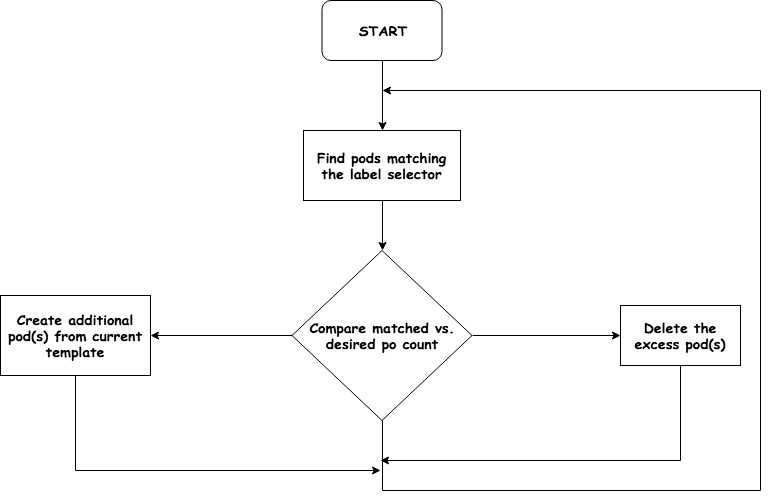
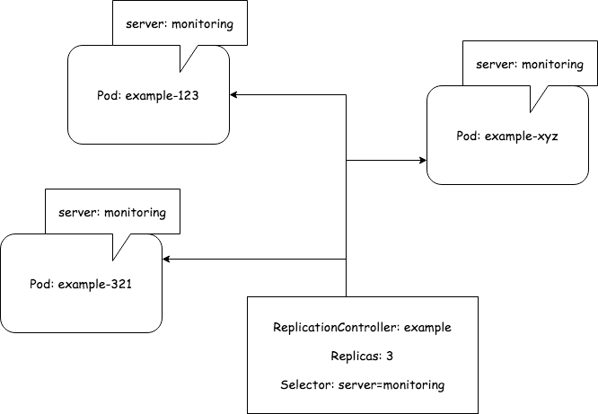
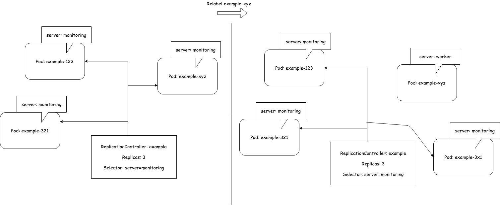
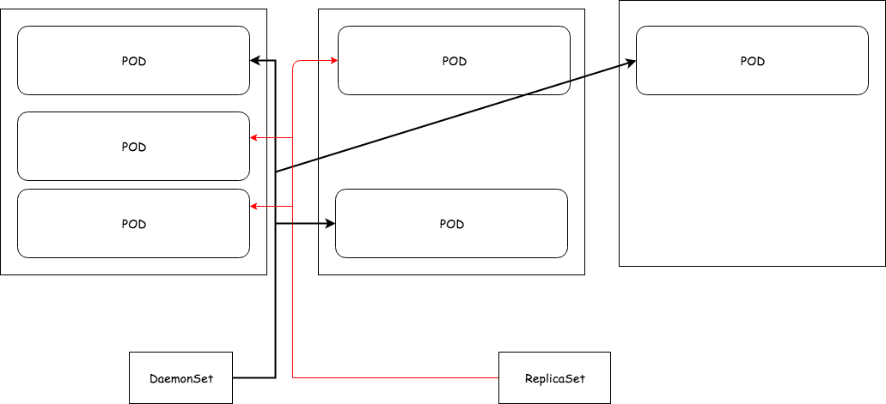

# Controllers

## Replication Controller

* Constantly monitors list of running pods of the same "type" and makes sure their number matches the desired number.
* If too few/much pods are running it creates additional/removes excess pods



### Essential parts
* label selector
* replica count
* pod template

### Usage benefits
* it makes sure a pod is always running by starting a new pod when an existing one goes down
* when a cluster node fails, it creates replacement replicas for all the pods that were running on the failed node
(under rc's scope)
* enables easy horizontal scaling

### YAML definifion

```yaml
apiVersion: v1
kind: ReplicationController
metadata:
  name: example
spec:
  replicas: 3
  template:
    metadata:
      labels:
        server: monitoring
    spec:
      containers:
      - name: swisnap
        image: solarwinds/solarwinds-snap-agent-docker:1.1.0
        env:
        - name: APPOPTICS_TOKEN
          value: token
```

```shell
kubectl create -f rc.yml
kubectl get rc
kubectl describe rc example
```



### Scope

```shell
# Add some new label to existing pod
kubectl label pod example-xxx type=psutil
kubectl get pods --show-labels

# Overwrite label of existing pod
kubectl label pod example-xxx server=worker --overwrite
kubectl get pods -L server
```



What would happen if instead of changing the labels of a pod, you modified the RC's label selector?

### Changing pod template

```shell
# Edit rc manifest
kubectl edit rc example
kubectl get po

# Change default editor
export KUBE_EDITOR=/usr/bin/nano

# Scaling
kubectl scale rc example --replicas=4

# Or
kubectl edit rc example
```

### Deleting RC

```shell
# Deleting rc together with pods
kubectl delete rc example

# Delete rc only - useful when there's need to switch to ReplicaSet/Deployment
kubectl delete rc example --cascade=false
```

## ReplicaSet

RS behaves exactly the same as RC, but it has more expressive label selector - it allows matching pods that lacks
certain label, or include a certain label regardless of its value.

### YAML definition

```yaml
apiVersion: apps/v1
kind: ReplicaSet
metadata:
  name: example
spec:
  replicas: 3
  selector:
    matchLabels:
      server: monitoring
  template:
    metadata:
      labels:
        server: monitoring
    spec:
      containers:
      - name: swisnap
        image: solarwinds/solarwinds-snap-agent-docker:1.1.0
        env:
        - name: APPOPTICS_TOKEN
          value: token
```

```shell
kubectl create -f rs.yml
kubectl get po

kubectl describe rs example
```

### Using more expressive selectors

```yaml
selector:
  matchExpressions:
    - key: server
      operator: In
      values:
        - monitoring
```

Valid operators:
* `In`
* `NotIn`
* `Exists`
* `DoesNotExist`

## Daemonsets

To run a pod on all cluster nodes, you create a DaemonSet, which is much like a RC or RS, except that pods created by a
DaemonSet already have a target node specified and skip the Kubernetes Scheduler. They aren't scattered around cluster
randomly.

If node goes down, DS doesn't cause the pod to be created elsewhere. But when a new node is added to the cluster, the DS
immediately deploys a new pod instance on it.



By default DS deploys pods to all nodes in the cluster, unless you specify nodeSelector in pod template.

### YAML definition
```yaml
apiVersion: apps/v1
kind: DaemonSet
metadata:
  name: example
spec:
  selector:
    matchLabels:
      monitoring: docker
  template:
    metadata:
      labels:
        monitoring: docker
    spec:
      nodeSelector:
        service: docker
      containers:
      - name: swisnap
        image: solarwinds/solarwinds-snap-agent-docker:1.1.0
        env:
          - name: APPOPTICS_TOKEN
            value: token
```

```shell
# Create DS
kubectl create -f ds.yml
kubectl get ds example

kubectl get po
```

## Jobs

Job is similar to the other resources, but it allows you to run a pod whose container isn't restarted when the process
running inside finishes successfully.
* In the event of a node failure, the pods on that node that are managed by Jon will be rescheduled to other nodes (same way RS does).
* In the event of a failure of the process, the Job can be configured to either restart the container or not.


### YAML definition
```yaml
apiVersion: batch/v1
kind: Job
metadata:
  name: example-job
spec:
  template:
    metadata:
      labels:
        app: example-job
    spec:
      restartPolicy: OnFailure
      containers:
      - name: job
        image: luksa/batch-job
```

```shell
kubectl create -f job.yml
kubectl get jobs
```

### Running multiple pod instances in a Job

Jobs may be configured to create more than one pod instance and run them in parallel or sequentially. This is done by
setting the `completions` and `parallelism` properties in Job spec.

```yaml
apiVersion: batch/v1
kind: Job
metadata:
  name: multicompletion-example-job
spec:
  completions: 5
  template:
    ....
```

Instead of running single Job pods one after the other, you can also make the Job run multiple pods in parallel.

```yaml
apiVersion: batch/v1
kind: Job
metadata:
  name: multi-completion-parallel-example-job
spec:
  completions: 5
  parallelism: 2
  template:
    ....
```

You can scale your Job when its running with:
```shell
kubectl scale multi-completion-parallel-example-job --replicas 3
```

## CronJob

```yaml
apiVersion: batch/v1beta1
kind: CronJob
metadata:
  name: example-job-every-quarter
spec:
  schedule: "0,15,30,45 * * * *"
  startingDeadlineSeconds: 15
  jobTemplate:
    spec:
      template:
        metadata:
          labels:
            app: periodic-job
        spec:
          restartPolicy: OnFailure
          containers:
          - name: job
            image: luksa/batch-job
```

## Notes

* Pods shouldn't be created directly, because they won't be recreated if they're deleted by mistake, if the node they're
running on fails, or if they're evicted from the node.
* RC always keeps the desired number of pod replicas running.
* Scaling pods horizontally is as easy as chaning the desired replica count on a RC.
* Pods aren't owned by the RC and can be moved between them if necessary.
* RC creates new pods from a pod template. Changing the template has no effect on existing pods.
* RC should be replaced with RS and Deployments, which provide the same functionality, but with additional powerful
features.
* RC and RS schedule pods to random cluster nodes, whereas DS makes sure every node runs a single instance of a pod
defined in DaemonSet.
* Pods that perform a single task should be created through a Job resource, not directly or through a RC or similar
object.
* Jobs that need to run sometime in the future can be created through CronJob resource.

