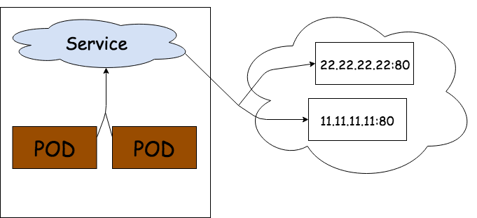
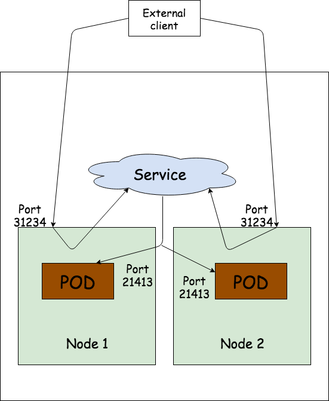

# Services

Kubernetes pods are ephemeral, if they go down they are substituted by new ones. Each pod gets it's own IP address, but as pods are ephemeral we cannot rely upon it. If some pods provide services to other pods inside the cluster they're using Kubernetes Services.
Kubernetes Service is an abstraction which defines a logical set of pods and policy for accessing them. Pods that are targeted by Service are usually determined by label selector.

## Problems solved by Services

* Pods are ephemeral
* Kubernetes assigns an IP address to a pod after the pod has been scheduled to a node and before it's started -
clients can't get IP address of the server pod upfront.
* horizontal scaling - multiple pods may provide the same service

## What is it?

Service is a resource you create to make a single, constant point of entry to a group of pods providing the same
service. Each service has an IP address and port that never change while the service exists. Connections to Service are
routed to one of the pods backing that service.


## Creating Service

Service uses the same mechanism to specify which pods are assigned to it as Controllers - label selector.


```yaml
apiVersion: v1
kind: Service
metadata:
  name: example-svc
spec:
  ports:
  - port: 80
    targetPort: 21413
  selector:
    server: monitoring
```

```shell
# Create ReplicaSet with 3 pods
kubectl create -f ../controllers/rs.yml
kubectl get rs

# Create our service
kubectl create -f example-svc.yml
kubectl get svc

# 3 ways to access api served on 21413 port
kubectl exec -it example-xxxx -- curl -s http://<svc-ip>/v1/tasks

kubectl exec -it example-xxxx bash
root@example-xxxx:$ curl http://<svc-ip>/v1/tasks

kubectl run -it ubuntu:xenial bash
root@ubuntu:$ curl http://<svc-ip>/v1/tasks
```


## Session Affinity

If you want all requests made by a certain client to be redirected to the same pod every time you can set the service's
`sessionAffinity` to `ClientIP` (None is default). Kubernetes doesn't support cookie-based session affinity.
```yaml
spec:
  sessionAffinity: ClientIP
```

## Exposing multiple ports in single Service

```yaml
apiVersion: v1
kind: Service
metadata:
  name: example-svc-2
spec:
  ports:
  - name: http
    port: 8080
    targetPort: 21413
  - name: https
    port: 8443
    targetPort: 8443
  selector:
    server: monitoring
```

## Discovering Services

Kubernetes provides ways for client pods to discover a service's IP and ports:
* discovering services through env vars
```shell
kubectl exec -it example-xxx env
kubectl delete pods --all
kubectl exec -it example-xxx env
```
* discovering services through DNS
```shell
kubectl get pods -n kube-system
```
This pod runs DNS server which all other pods running in the cluster are automatically configured to use (Kubernetes modifies each container's `/etc/resolv.conf` file)
Each sevice gets a DNS entry in the internal DNS server.
```shell
kubectl exec example-xxx -- curl http://example-svc.default.svc.cluster.local/v1/tasks
```
As you can see client still needs to know the service's port.
```shell
kubectl exec -it example-xxx bash
root@example-xxx:$ cat /etc/resolv.conf

# Warning - this won't work
root@example-xxx:$ ping example-svc
```

## Connecting to services living outside of the cluster

Cases exist when you'd like to expose external services through the Kubernetes services feature. Instead of haveing the
service redirect connections to pods in the cluster, you want it to redirect to external IP(s) and port(s).

```shell
kubectl describe svc example-svc

kubectl get endpoints example-svc
```

### Manually configuring endpoints

Having the service's endpoints decoupled from the service allows them to be configured and updated manually. If you
create service without label selector Kubernetes won't create Endpoints resource.

```yaml
apiVersion: v1
kind: Service
metadata:
  name: external-service
spec:
  ports:
  - port: 80
---
apiVersion: v1
kind: Endpoints
metadata:
  name: external-service
subsets:
  - addresses:
    - ip: 11.11.11.11
    - ip: 22.22.22.22
    ports:
    - port: 80
```


If you decide to migrate the external service to pods running inside Kubernetes, you can add a selector to the service
making its Endpoints managed automatically. The same is also true in reverse - by removing the selector from a Service
Kubernetes stops updating the Endpoints.

### Alias for external service

```yaml
apiVersion: v1
kind: Service
metadata:
  name: external-service
spec:
  type: ExternalName
  externalName: api.appoptics.com
  ports:
  - port: 80
```

## Exposing services to external clients

### NodePort

```yaml
apiVersion: v1
kind: Service
metadata:
  name: example-nodeport
spec:
  type: NodePort
  ports:
  - port: 80
    targetPort: 21413
    nodePort: 12345 # not necessary
  selector:
    server: monitoring
```

```shell
kubectl create -f nodeport.yml
minikube service example-nodeport
```



### LoadBalancer

```yaml
apiVersion: v1
kind: Service
metadata:
  name: example-loadbalancer
spec:
  type: LoadBalancer
  ports:
  - port: 80
    targetPort: 21413
  selecetor:
    server: monitoring
```

### Ingress

<i>Ingress<i> - act of going in or entering; entryway; the right to enter; a means or place of entering

Ingresses are needed because each `LoadBalancer` service requires its own load balancer with its own public IP address - Ingress requires only one, even when its providing access to multiple services. When client sends request to Ingress, the host and path in the requests determine which service the request is forwarded to.

To make Ingress resources work, an Ingress controller needs to be running in the cluster.
